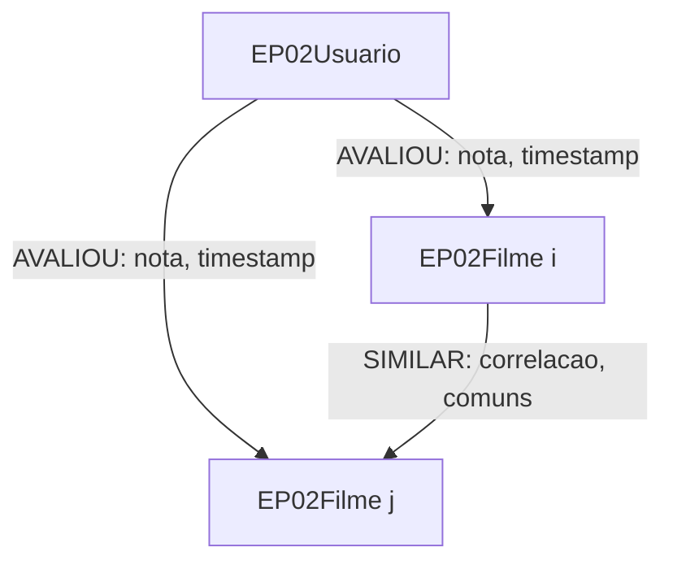

# Modelagem e metodologia

## Modelagem do grafo

| Elemento | Identidade | Atributos |
| --- | --- | --- |
| `EP02Usuario` | `(execucao, userId)` | ID anônimo e execução |
| `EP02Filme` | `(execucao, movieId)` | `titulo`, `generos` (lista), `mediaTreino`, `quantidadeTreino` |
| `EP02Execucao` | `id` | `k`, `minComuns`, `mediaGlobal`, `seed`, `sha256Treino`, `pronto` |
| `AVALIOU` | Usuário → filme | `nota`, `timestamp` Unix |
| `SIMILAR` | Filme menor ID → filme maior ID | `correlacao`, `comuns` |

Todos os filmes são inseridos. Gêneros são atributos: `(no genres listed)` vira lista vazia. Uma avaliação representa uma interação registrada, não comprovação de que o usuário assistiu ao filme inteiro. `SIMILAR` é matematicamente simétrica: guardamos uma relação por par (`i < j`) e consultamos sem direção. Constraints garantem a identidade dos nós.

As execuções são isoladas. A importação usa transações por lote, **não uma transação única para o processo inteiro**. Em caso de interrupção, os lotes anteriores permanecem com `pronto=false`, e as consultas recusam esse modelo incompleto. Uma nova importação usa outro identificador; nenhum banco é apagado.

## Dados e split

Somente `movies.csv` e `ratings.csv` são lidos. A validação exige cabeçalhos, IDs positivos, filmes existentes, títulos, timestamps não negativos e notas finitas em `[0.5,5]`. Avaliações duplicadas para o mesmo par usuário–filme são rejeitadas.

Ordenamos por `(userId, movieId)`, embaralhamos com `random.Random(42)` e reservamos `round(0.2 * total)` para teste. O restante é treino. No MovieLens Small: **80.669 notas de treino e 20.167 de teste**. O arredondamento explica a pequena diferença para 20% exatos. O split é global aleatório, não temporal nem estratificado.

O catálogo de títulos e gêneros é conhecido desde o início, mas **médias, similaridades, suporte e candidatos são obtidos somente do treino**. O teste é usado somente nas métricas. Os hashes registram os conjuntos usados e a integridade dos artefatos. Usuários ou filmes sem avaliações de treino têm fallback explícito.

## Pearson

Seja $U_{ij}$ o conjunto de usuários que avaliaram ambos os filmes no treino, e $\bar r_i$ a média de **todas** as avaliações de treino do filme $i$:

$$
c(i,j)=\frac{\sum_{u\in U_{ij}}(r_{ui}-\bar r_i)(r_{uj}-\bar r_j)}{\sqrt{\sum_{u\in U_{ij}}(r_{ui}-\bar r_i)^2}\sqrt{\sum_{u\in U_{ij}}(r_{uj}-\bar r_j)^2}}.
$$

O enunciado define a média do filme; adotamos a média global desse filme no treino. Outra variante possível recalcula a média apenas na interseção, mas essa não é a variante do treinamento. Um teste específico confere a escolha.

Notas ausentes não são preenchidas com zero. Para cada filme, percorremos seus usuários e os outros filmes dos históricos deles, acumulando numerador e denominadores apenas nos pares coavaliados. A memória temporária contém os pares do filme corrente; não há matriz densa. O custo é proporcional à soma dos quadrados dos tamanhos dos históricos, e o armazenamento final ao número de arestas válidas. O conjunto MovieLens completo exige outra estratégia de escala.

Escolhas para situações não fixadas no enunciado:

- Mínimo padrão de **3 usuários comuns**, configurável a partir de 2.
- Denominador nulo → correlação zero, sem relação no grafo.
- Correlações de módulo ≤ `1e-12` são descartadas; valores limitados a `[-1,1]` por arredondamento.
- Correlações positivas **e negativas** são preservadas. Não aplicamos shrinkage ou ajuste de viés.
- Não truncamos globalmente as similaridades: K é aplicado na vizinhança específica do usuário.

## KNN e top-N

Para prever a nota do usuário $u$ no filme $i$, selecionamos até $K=20$ filmes vizinhos que **o próprio usuário avaliou no treino**. Ordenamos por maior Pearson, maior suporte e menor ID:

$$
\hat r_{ui}=\frac{\sum_{j\in N_K(u,i)}c(i,j)r_{uj}}{\sum_{j\in N_K(u,i)}|c(i,j)|}.
$$

A fórmula de previsão no Notion escreve a nota com índices `r_i^k`, apesar de a soma variar por `j`. Interpretamos esse fator como **a nota do usuário-alvo no filme vizinho, `r_uj`**, necessária para prever uma nota desconhecida. Não usamos a nota do filme-alvo nem a nota de teste na soma.

Os sinais são preservados no numerador. Correlações negativas podem produzir uma nota bruta fora da escala: limitamos a saída a `[0.5,5]` e preservamos `nota_bruta` na explicação local. Não subtraímos a média do usuário, pois isso alteraria a fórmula exigida.

Sem vizinhos válidos, usamos média do filme → média do usuário → média global, sempre de treino. O campo `metodo` registra o caso. Filme fora do catálogo é erro; usuário desconhecido recebe ranking pelas médias dos filmes.

O top-N pontua **todos os filmes com pelo menos uma avaliação de treino que ainda não foram avaliados pelo usuário no treino**. Não restringimos candidatos aos filmes do teste. Filmes sem evidência de treino são excluídos do ranking, mas ainda podem receber previsão por fallback na avaliação. Empates: quantidade de avaliações de treino e ID.

As consultas Cypher são parametrizadas e isoladas por execução. `comedias` conta `'Comedy' IN generos` e `nota >= 4`; `estatisticas` agrega quantidade e média; `recomendar` seleciona K vizinhos e faz a regressão **dentro do banco**, com o mesmo fallback, clipping e desempate de Python.

## Avaliação

Como o enunciado não especifica o protocolo de precisão/recall, entregamos duas interpretações, com limiar padrão de relevância **nota ≥ 4**.

**Notas de teste:** uma avaliação real ≥ 4 é positiva; uma previsão ≥ 4 é positiva. Todas as notas são incluídas, inclusive fallbacks. Registramos matriz de confusão, precisão, recall, F1, MAE, RMSE e cobertura do KNN:

$$
P=\frac{TP}{TP+FP},\qquad R=\frac{TP}{TP+FN}.
$$

**Ranking:** $T_u$ contém os filmes relevantes no teste e $L_u$ contém o top-N do usuário no catálogo de treino:

$$
P@N(u)=\frac{|L_u\cap T_u|}{|L_u|},\qquad R@N(u)=\frac{|L_u\cap T_u|}{|T_u|}.
$$

A precisão usa o número efetivamente retornado se houver menos de N candidatos. Denominadores zero produzem métrica zero. Usuários sem relevantes são contados à parte e excluídos das médias de ranking. A média macro dá o mesmo peso a cada usuário elegível; a micro agrega acertos e denominadores. Relevantes sem evidência no treino permanecem no denominador de recall, para não ocultar cold start.

Itens não observados no teste não podem ser confirmados como irrelevantes: medimos recuperação da relevância **observada**, uma limitação de feedback incompleto. Split aleatório não simula necessariamente o futuro. Os parâmetros são fixados antes da avaliação; o teste não é usado para escolhê-los. Os resultados não demonstram superioridade a outros modelos.
